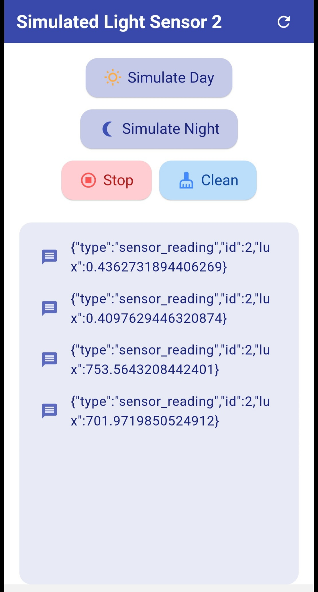

# Simulated Light Sensor App

This Flutter app simulates a light sensor that communicates over MQTT, providing light intensity readings for both "Day" and "Night" settings. It’s a simple but effective tool to demonstrate how a sensor might send live data over MQTT to be read by other devices.

## Features

- **Light Simulation:** Choose between two light conditions:
  - **Day Mode**: Simulates well-lit conditions, around 750 lux with some variation.
  - **Night Mode**: Simulates near darkness, around 0.5 lux with minimal variation.
- **Real-Time Controls:** Start and stop the simulation at any time and clear the message log when needed.
- **MQTT Connectivity:** Connects to an MQTT broker and sends lux readings at intervals for other devices or services to read.

## How It Works

1. **MQTT Connection**: The app connects to an MQTT broker (by default, `test.mosquitto.org`) when it starts, allowing it to publish messages and listen for updates on a specific topic.
2. **Simulated Light Levels**: When you press "Simulate Day" or "Simulate Night," the app sends randomized lux values for the selected mode at regular intervals.
3. **Message Log**: All received MQTT messages are displayed in the log, so you can track the sensor data being sent.

## Usage

1. **Run the App**: Once the app is running, it will automatically connect to the MQTT broker.
2. **Simulate Light Levels**: Tap on "Simulate Day" or "Simulate Night" to start sending light readings.
3. **Stop Simulation**: Tap "Stop" to stop sending readings.
4. **Clear Messages**: Tap "Clean" to clear the message log.

## Screenshot

# Simulated Light Sensor App

This Flutter app simulates a light sensor that communicates over MQTT, providing light intensity readings for both "Day" and "Night" settings. It’s a simple but effective tool to demonstrate how a sensor might send live data over MQTT to be read by other devices.

## Features

- **Light Simulation:** Choose between two light conditions:
  - **Day Mode**: Simulates well-lit conditions, around 750 lux with some variation.
  - **Night Mode**: Simulates near darkness, around 0.5 lux with minimal variation.
- **Real-Time Controls:** Start and stop the simulation at any time and clear the message log when needed.
- **MQTT Connectivity:** Connects to an MQTT broker and sends lux readings at intervals for other devices or services to read.

## How It Works

1. **MQTT Connection**: The app connects to an MQTT broker (by default, `test.mosquitto.org`) when it starts, allowing it to publish messages and listen for updates on a specific topic.
2. **Simulated Light Levels**: When you press "Simulate Day" or "Simulate Night," the app sends randomized lux values for the selected mode at regular intervals.
3. **Message Log**: All received MQTT messages are displayed in the log, so you can track the sensor data being sent.

## Usage

1. **Run the App**: Once the app is running, it will automatically connect to the MQTT broker.
2. **Simulate Light Levels**: Tap on "Simulate Day" or "Simulate Night" to start sending light readings.
3. **Stop Simulation**: Tap "Stop" to stop sending readings.
4. **Clear Messages**: Tap "Clean" to clear the message log.

## Screenshot

  

In the screenshot above, you can see the main interface of the **Simulated Light Sensor** app. The interface includes:

- **Simulate Day Button**: This button, with a sun icon, starts the simulation for "Day" mode, sending lux readings around 750 lux.
- **Simulate Night Button**: The moon icon indicates "Night" mode, which sends lux readings near 0.5 lux, simulating low-light conditions.
- **Stop Button**: This red button stops the simulation, halting any messages being sent to the MQTT broker.
- **Clean Button**: Clears all the received messages from the log displayed below.
- **Message Log**: Shows each MQTT message sent, formatted as JSON. Each message includes:
  - **type**: Identifies the message type, here as `sensor_reading`.
  - **id**: The sensor ID, set to `2` in this case.
  - **lux**: The current simulated lux value, showing real-time changes for "Day" or "Night" mode.

The message log at the bottom is styled to clearly display each message as it’s received, allowing for easy monitoring of the light level readings being sent.

## Customization

- **MQTT Broker**: You can change the MQTT broker by updating the line `MqttServerClient('test.mosquitto.org', '')` in the code.
- **Light Levels**: Modify the light levels and variation ranges in the `_simulateDay` and `_simulateNight` methods for different simulation conditions.

## License

This project is licensed under the MIT License.

In the screenshot above, you can see the main interface of the **Simulated Light Sensor** app. The interface includes:

- **Simulate Day Button**: This button, with a sun icon, starts the simulation for "Day" mode, sending lux readings around 750 lux.
- **Simulate Night Button**: The moon icon indicates "Night" mode, which sends lux readings near 0.5 lux, simulating low-light conditions.
- **Stop Button**: This red button stops the simulation, halting any messages being sent to the MQTT broker.
- **Clean Button**: Clears all the received messages from the log displayed below.
- **Message Log**: Shows each MQTT message sent, formatted as JSON. Each message includes:
  - **type**: Identifies the message type, here as `sensor_reading`.
  - **id**: The sensor ID, set to `2` in this case.
  - **lux**: The current simulated lux value, showing real-time changes for "Day" or "Night" mode.

The message log at the bottom is styled to clearly display each message as it’s received, allowing for easy monitoring of the light level readings being sent.

## Customization

- **MQTT Broker**: You can change the MQTT broker by updating the line `MqttServerClient('test.mosquitto.org', '')` in the code.
- **Light Levels**: Modify the light levels and variation ranges in the `_simulateDay` and `_simulateNight` methods for different simulation conditions.

## License

This project is licensed under the MIT License.

